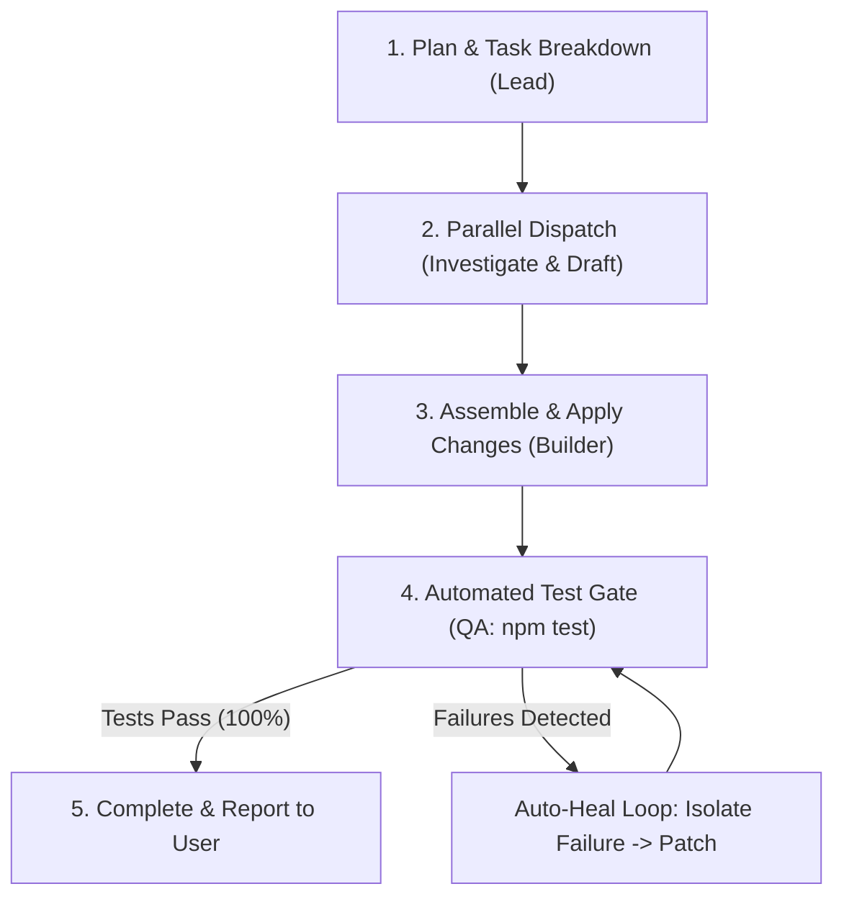

# Team Agent Orchestrator & Autonomous Task Loops

Guide for orchestrating multi-agent teams, running autonomous development loops, and delegating specialized subtasks using Antigravity subagents.

---

## 1. Multi-Agent Team Roles

| Role | Preset / Tooling | Core Responsibility | When to Dispatch |
| :--- | :--- | :--- | :--- |
| **Lead / Coordinator** | Main Agent Context | Task decomposition, dependency tracking, merging outputs, and user interaction. | Main conversation loop. |
| **Investigator** | `research` subagent / `cavecrew-investigator` | Code localization, finding symbol definitions, tracing audio/lesson data paths. | Broad searches, file discovery across `source/src/`. |
| **Builder / Developer** | `self` subagent / `cavecrew-builder` | Writing code, implementing React components, updating CSS tokens, editing schemas. | Focused single-feature or 1–2 file edits. |
| **QA / Reviewer** | `self` subagent / `cavecrew-reviewer` | Running `npm test`, checking diffs, inspecting mobile contracts, and verifying regression safety. | Pre-commit validation and diff auditing. |

---

## 2. Autonomous Task Execution Loop (Plan → Dispatch → Test → Heal)



### The 4-Phase Loop Protocol

1. **Phase 1: Task Decomposition**:
   - Break large user requests into atomic milestones (e.g. 1: Data schema, 2: React component, 3: CSS styling, 4: Tests).
2. **Phase 2: Parallel Delegation**:
   - Spawn subagents in parallel using `invoke_subagent` for read-only exploration or independent tasks.
3. **Phase 3: Automated Verification**:
   - Run the local test runner: `cd source && npm test`.
   - Never consider a task done without automated proof.
4. **Phase 4: Auto-Healing Loop**:
   - If tests fail, extract the failure message and stack trace.
   - Hand the error to a builder subagent or resolve surgically.
   - Re-run tests until all suites pass.

---

## 3. Delegation Patterns & Commands

### Pattern A: Parallel Exploration
Launch multiple research agents concurrently to analyze different parts of the system:
- Agent 1: Inspect audio routing in [`group3Audio.js`](file:///home/nong_ing/group3-standalone/source/src/surfaces/group-3-8104/services/audio/group3Audio.js).
- Agent 2: Inspect game mechanics in [`card-frenzy/`](file:///home/nong_ing/group3-standalone/source/src/surfaces/group-3-8104/features/games/card-frenzy/).

### Pattern B: Continuous Background Monitoring (Cron / Schedule)
For long-running tasks or periodic health checks:
- Use `schedule` tool for timed wake-ups or recurring cron schedules.
- Use `manage_task` to inspect and interact with background CLI commands.

---

## 4. Subagent Tooling Quick Reference

```javascript
// Spawning subagents
invoke_subagent({
  Subagents: [
    {
      TypeName: "research",
      Role: "Codebase Investigator",
      Prompt: "Locate all occurrences of playUiCue in features/reader and report paths.",
      Model: "flash"
    }
  ]
})
```
